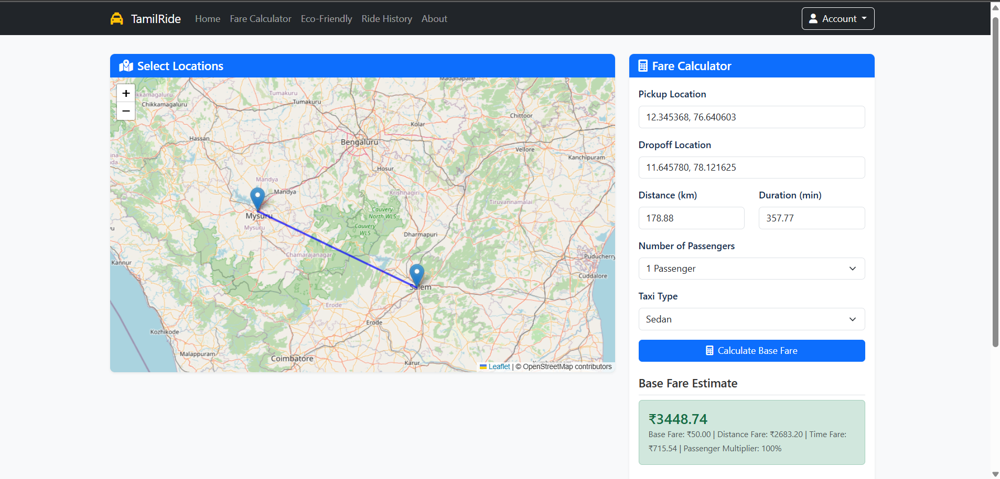

# 🚖 TaxiRide – Taxi Fare Estimator

*TaxiRide* is a Python-based web application that helps users estimate taxi fares based on real-time distance and duration between pickup and drop locations. The app provides an intuitive UI, interactive map selection, and dynamic fare calculation logic.

 

## 🌐 Live Demo
🔗 https://taxiride.onrender.com

## 📌 Features

- 🗺 Select pickup and drop-off locations using an interactive map (Leaflet + OpenStreetMap)
- 🚕 Choose taxi type: Sedan, SUV, Mini, etc.
- 👥 Passenger count affects fare (custom multiplier)
- 🧮 Real-time fare calculation based on:
  - Base fare
  - Distance traveled
  - Time duration
  - Passenger multiplier
- 💻 Responsive design for all devices
